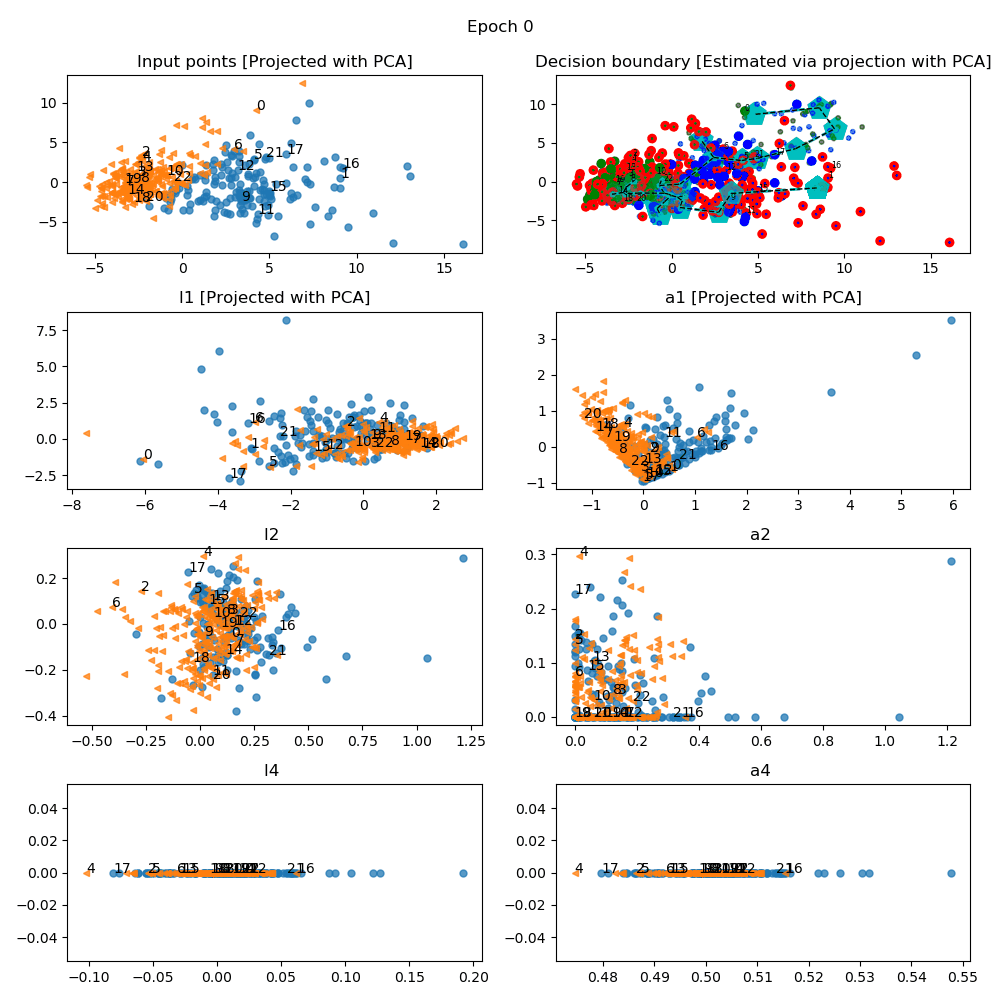

# geoviz
 **Geoviz is a pytorch-compatible library with learning purposes for the geometric visualization of the transformations inside simple feedforward neural networks.**

<!--  -->


## Requirements
Python<3.12

## Installation
To install geoviz, first download or clone the code from the repository: 

```bash
git clone https://github.com/fpier21/geoviz.git 
```
Then, inside the main folder install it with pip. The library requires torch to be installed. In case you haven't it already, you can install geoviz with pytorch in CPU only version via: 

```bash
pip install . --extra-index-url https://download.pytorch.org/whl/cpu
```

If instead you want geoviz together with full CUDA platform pytorch just execute: 

```bash
pip install .
```
## Brief Description
Geoviz can produce **images** or **gifs** showing the learning process of simple neural networks. It plots the transformations of the training points along the network at different epochs.

An image producted by geoviz plotting methods is a **photography** of the network **at a certain epoch**. The featured subplots are: 
- Input (training) points.
- Decision boundary.
- Points after transformation of layer l_{i}.
- Points after activation a_{i}.

A gif produced by geoviz is created by appending the images for each epoch, with a certain step. 

If the input points or some layers live in dimension>3, it is possible to specify a dimensionality reduction method to project to 2D points/decision hyper-surface/layers. 

## Usage
There are a few easy steps to follow in order to make the pytorch model compatible with geoviz, which are reported in the lines below.
The first thing is to define the pytorch model by subclassing ```VizModule```. 

```python
from geoviz import geo_viz, VizModule
import torch 
import torch.nn as nn

class MyModule(VizModule): 
    def __init__(self): 
        ...
    def forward(self, x):
        ...
    def predict(self, x): 
       ...

model = MyModule()
```
At the end of your training loop of the pytorch model, you have to add the following line in order to update the geoviz model: 
```python
for epoch in range(num_epochs): 
    ##Train model:loss.backward(), optimizer.step()...
    model.viz_update(epoch)
```
At this point, it's possible to instantiate the model and to plot/render a gif about the training process of the model. 

```python
##Instantiate the model
visualizator = geo_viz(x_train,y_train,model)
##Plot a figure of the transformations at a specific epoch, with several plotting configuration like figsize, percentage of annotation...
fig = visualizator.plot(epoch, 
                        figsize, 
                        annotate,
                        plot_grid, 
                        ...)
##Make a gif to show changes across the epochs. You can specify some proper params like duration and or step, as well as all the .plot method params for the single images. 
visualizator.make_gif(path_out,
                        duration,
                        figsize,
                        annotate, 
                        ...)
```

## Technical notes & Reminders
The plotting parameter ```plot_grid=True``` builds the transformation grids *only if there are no layers with dim>3* in the network, otherwise it has no effect. \
For training sets with dimension>3, it's not trivial how to project in 2D the decision hyper-surface. In geoviz, the great work [of the highdimensional-decision-boundary-plot
repo](https://github.com/tmadl/highdimensional-decision-boundary-plot/tree/master) is exploited. Because the repo is not actively maintaned by some years, some minor changes were necessary to make it a proper library, which are collected in the [forked version](https://github.com/fpier21/highdimensional-decision-boundary-plot/tree/dev) listed in the requirements. Also, be aware that the above project was anyway experimental, and it may take a while for rendering the decision boundary subplot (if you want to plot it).

## Examples 

### 2D XOR problem with layer dimension <4. 
The XOR problem is a classic problem in ANN research, because of its non-linear decision boundary. \
In 2D, an example dataset for the problem is: 
```
import matplotlib.pyplot as plt 
import numpy as np
import torch

torch.manual_seed(1)
np.random.seed(1)

x = np.random.uniform(low=-1, high = 1, size= (200,2))
y = np.ones(len(x))

y[x[:,0]*x[:,1] < 0] = 0

n_train = 100
x_train = torch.tensor(x[:n_train, :], dtype = torch.float32)
y_train = torch.tensor(y[:n_train], dtype = torch.float32)
x_valid = torch.tensor(x[n_train: , :], dtype=torch.float32)
y_valid = torch.tensor(y[n_train:], dtype = torch.float32)

fig = plt.figure(figsize=(6,6))
plt.plot(x[y==0, 0], x[y==0,1], 'o', alpha = 0.75, markersize= 10)
plt.plot(x[y==1, 0], x[y==1,1], '<', alpha = 0.75, markersize= 10)
plt.legend(['Label 0', 'Label 1'])
plt.tight_layout()
plt.show()
```


---
Defining and train a simple model with all layers in dim<3.

```
from torch.utils.data import DataLoader, TensorDataset

##Defining the model
class MyModule(VizModule): 
    def __init__(self): 
        super().__init__()
        self.l1 = nn.Linear(2,3)
        self.a1 = nn.Tanh()
        self.l2 = nn.Linear(3,3)
        self.a2 =  nn.Tanh()
        self.l3 = nn.Linear(3,3)
        self.a3 =  nn.Tanh()
        self.l4 = nn.Linear(3,1)
        self.a4 = nn.Sigmoid()
        #self.activations = [nn.Sigmoid(), nn.Sigmoid()] 
        self.module_list = [self.l1,self.a1, self.l2, self.a2, self.l3, self.a3,self.l4, self.a4]
        
    def forward(self, x):
        for f in self.module_list: 
            x = f(x)
        return x
    
    def predict(self, x): 
        x = torch.tensor(x, dtype = torch.float32)
        pred = self.forward(x, None)[:,0]
        return (pred>=0.5).float()

torch.manual_seed(320)
model = MyModule()

## Set the dataloader
train_ds = TensorDataset(x_train, y_train)
batch_size = 2
torch.manual_seed(1)
train_dl = DataLoader(train_ds, batch_size, shuffle=True)

## Defining training loop
def train(model, num_epochs, train_dl, x_valid, y_valid):
        loss_hist_train = [0]*num_epochs
        loss_hist_valid = [0]*num_epochs
        accuracy_hist_train = [0]*num_epochs
        accuracy_hist_valid = [0]*num_epochs

        for epoch in range(num_epochs): 
             for x_batch, y_batch in train_dl: 
                pred = model(x_batch)[:,0]
                loss = loss_fn(pred,y_batch)
                loss.backward()
                optimizer.step()
                optimizer.zero_grad()
                loss_hist_train[epoch] += loss.item()
                is_correct = ((pred >= 0.5).float() == y_batch).float()
                accuracy_hist_train[epoch] += is_correct.mean() 
             
             loss_hist_train[epoch] /= n_train/batch_size
             accuracy_hist_train[epoch] /= n_train/batch_size
             pred = model(x_valid)[:,0] 
             loss = loss_fn(pred,y_valid)
             loss_hist_valid[epoch] = loss.item()
             is_correct = ((pred>=0.5).float() == y_valid).float()
             accuracy_hist_valid[epoch] += is_correct.mean()

             model.viz_update(epoch)

        return loss_hist_train, loss_hist_valid, \
                accuracy_hist_train, accuracy_hist_valid
##Train 
loss_fn = nn.BCELoss()
num_epochs = 300
optimizer = torch.optim.SGD(model.parameters(), lr=0.02) 
history = train(model, num_epochs, train_dl, x_valid, y_valid)
```

Once the model is trained, we can use geoviz to analyze it. 
```
visualizator = geo_viz(x_train,y_train,model)
visualizator.make_gif("MY_PATH.gif", 
                      duration=1000, 
                      figsize=(10,10),
                      annotate=0.05)
```


---

**Convergence of the model becomes clear not only thanks to the performance metrics, but also from a geometric point of view**. 

### Dim>3.
It's also possibile to handle and visualize models of dimension>3. In the next example we see the case of the [breast cancer wiscosin diagnostic dataset](https://archive.ics.uci.edu/dataset/17/breast+cancer+wisconsin+diagnostic). The input points and thus the decision hyper-surface live in dim 30. Also, we consider as pytorch model a network with hidden layers of dim>4. 

In such situations, we can pass to geoviz a **dimensionality reduction** object. This will project the network layers to 2D as well as provide highdimensional-decision-boundary-plot a way to estimate and project the decision surface. 
The API for the dimensionality reduction object is scikit-learn compatibile and it requires a .fit and .transform method. 
```
...
## Load the dataset and scale it, define the pytorch model and train it as in the example before. In this example the model is 30-16-2-1 with relu activations and sigmoid at the end.
...
from sklearn.decomposition import PCA

visualizator = geo_viz(X_train=x_train,
                       y_train=y_train,
                       model=model, 
                       DR=PCA(n_components=2), 
                       estimate_decision_boundary=True
                       )
visualizator.make_gif("MY_PATH.gif", 
                      duration=1000, 
                      figsize=(10,10),
                      annotate=0.05)
```


---  

**It becomes evident how the non-linear activations bend the space to make the points linearly separable.**


